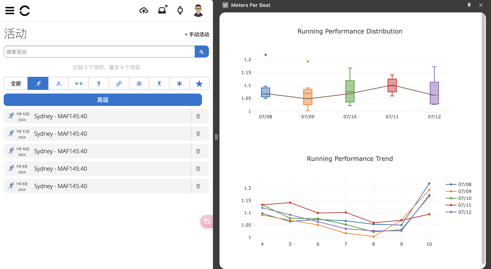

# Meters Per Beat 



## Build Chrome Extension

```bash
source .envrc
npm ci 
npm run build
```

## Local Install Chrome Extension

Please see <https://developer.chrome.com/docs/extensions/get-started/tutorial/hello-world#load-unpacked> .